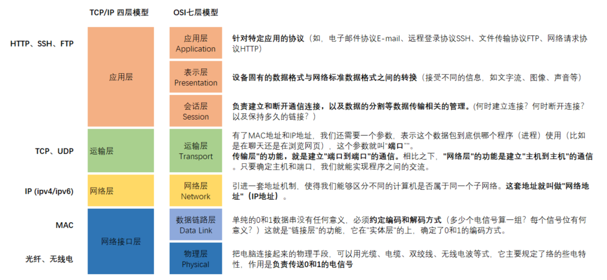
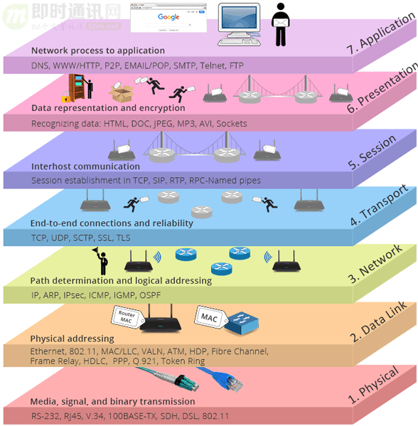
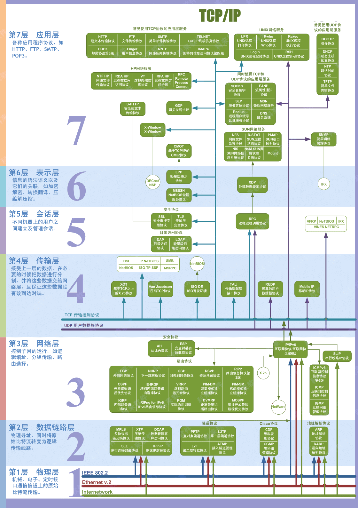

# network 网络

计算机网络的的设计目的，就是为了实现计算机之间的通信。

计算机网络是指通过通信链路和交换设备将多台计算机连接在一起，以实现资源共享和信息交换的系统。

简单来说，计算机网络使得计算机之间能够相互通信，实现资源共享和信息交换。

## 历史

> 引用：https://wzp-coding.github.io/blog-press/technology/computer-network/#internet-%E7%9A%84%E9%98%B6%E6%AE%B5%E6%80%A7%E5%8F%91%E5%B1%95

Internet是人类历史发展中的一个伟大的里程碑，人们用各种名称来称呼Internet，如国际因特网络、因持网，互联网、交互网络、网际网等等，它正在向全世界各大洲延伸和扩散，不断增添吸收新的网络成员，已经成为世界上覆盖面最广、规模最大、信息资源最丰富的计算机信息网络。

在固定电话时代（1876年起），使用电话通信需要架设一条专门的物理线路，并使用电话机进行通信。在通话结束前，这条线路上哪怕没有声音，别人也不能用。这样资源浪费严重，且一旦中间的线路断了，通话就彻底中断。

到了 1960 年代，当时，美国国防部为了保证美国本防卫量和海外防御武装在受到前苏联第次核打击以后仍然具有定的存和反击能力，认为有必要设计出一种分散的指挥系统；它由一个个分散的指挥点组成，当部分指挥点被摧毁后，其它点仍能正常作，并且在这些点之间能够绕过那些已被摧毁的指挥点继续保持联系。

为了对这构思进验证，1969年，美国国防部国防级研究计划署(DOD/DARPA)资助建了一个名ARPANET(即"阿帕网")的网络，这个网络把位于洛杉矾的加利福尼亚大学、位于圣芭芭拉的加利福尼亚大学、斯坦福大学，以及位于盐湖城的犹它州州立大学的计算机主机联接起来，位于各个结点的大型计算机采用**分组交换**技术，通过专门的通信交换机和专门的通信线路相互连接。这个阿帕网就是 internet 最早的雏形。从某种意义上说，Internet可以说是美苏冷战的产物。

到1972年时，ARPANET上的点数已经达到40个，这40个网点彼此之间可以发送小文本文件(当时称这种文件为电子邮件，也就是我们现在的E-mail)和利用文件件传输协议发送大本件，包括数据文件(即现在Internet的FTP协议)，同时也发现了通过把一台电脑模拟成另一台远程电脑的一个终端，从而可以使用远程电脑上资源，这种做法被称为Telnet。由此可看到 E-mail、FTP和 Telnet 是 Internet 上较早出现的重要工具，E-mail 和FTP仍然是目前Internet上最主要的应用。

相互通信的两个计算机系统必须高度协调合作，这种协调是相当复杂的。为了设计这样复杂的计算机网络，早在ARPANET设计初期就提出了分层方法。通过分层，庞大而复杂的问题被转化为较小的局部问题，更易于研究和解决。1972年，全世界电脑业和通讯业的专家学者在美国华盛顿举了第届国际计算机通信会议，就在不同的计算机网络之间进通信达成协议。会议决定成立Internet 工作组，负责建立一种能保证计算机之间进行通信的标准规范即"通信协议"。1973年，美国国防部也开始研究如何实现各种不同网络之间的互联问题。

到1974年，IP(Internet协议)和TCP(传输控制协议)问世，合称TCP/IP协议。这两个协议定义了一种在电脑网络间传送报文(文件或命令)的方法。随后，美国国防部决定向全世界无条件地免费提供TCP/IP，即向全世界公布解决电脑络之间通信的核技术。TCP/IP协议的核心技术的公开最终促进了Internet的大发展。

到1980年，世界上既有使用TCP/IP协议的美国军的ARPA网，也有很多使其它通信协议的各种网络。为了将这些络连接起来，美国温顿·瑟夫(VintonCerf)提出一个想法：在每个网络内部各自使用自己的通讯协议，在和其它络通信时使TCP/IP协议。这个设想最终导致了 Internet 的诞生，并确立了 TCP／IP 协议在网络互联方面的地位。

80年代初，ARPANET取得了巨成功，但没有获得美国联邦机构合同的学校仍不能使。为解决这问题，美国国家科学基金会(National ScienceFoundation简称NSF)开始着手建立提供给各大学计算机系使用的计算机科学网(CSNet)。CSNet是在其他基础络之上加统一的协议层，形成逻辑上的网络，它使用其他网络提供的通信能力，在用户端点下也是一个独立的网络。CSNet 采用集中控制方式，所有信息交换都经过 CSNet-Relay(一台中继计算机)进行。

以上这些网络都相继并入Internet 成为它的一个组成部分，因而 Internet成为全世界各种网络的大集合。

Internet的又一次快速发展源于美国国家科学基金会(National ScienceFoundation简称NSF)的介入，建立NSFNET。80年代初，美国一大批科学家呼吁实现全美的计算机和络资源共享，以改进教育和科研领域的基础设施建设，抵御欧洲和日本先进教育和科技进步的挑战和竞争。80年代中期，美国国家科学基金会(NSF)为鼓励大学和研究机构共享NSF自己非常昂贵的4台巨型计算机，希望各大学、研究所的计算机与这4台巨型计算机联接起来。最初NSF曾试图使ARPANet作NSFNET的通信干线，但由于ARPANet的军用性质，并且受控于政府机构，这个决策没有成功；于是他们决定自己出资，利用ARPANET发展出来的TCP/IP通讯协议，建立名为NSFNET的广域网。

1986年NSF投资在美国普林斯顿大学、匹兹堡大学、加州大学圣地亚哥分校、依利诺斯大学和康纳尔大学建立5个超级计算中心，并通过 56Kbps 的通信线路连接形成NSFNET的雏形。1987年NSF公开招标对NSFNET进行升级、营运和管理，结果IBM、MCI和由多家大学组成的非盈利性机构Merit获得NSF的合同。1989年7月，NSFNET的通信线路速度升级到了T1(1.5MbpS)，并且连接13个骨干结点，采用MCI提供的通信线路和IBM提供的路由设备，Merit则负责NSFNET的营运和管理。由于NSF的鼓励和资助，很多学校、政府机构，甚至私营的研究机构纷纷把自己的局域网并NSFNET中，从1986年至1991年，NSFNET的网从100个迅速增加到3000多个。NSFNET的正式营运，以及实现与其他已有和新建络的连接，开始真正成为Internet 的基础。

Internet 在 80 年代的扩张不单带来量的改变，同时带来了某些质的变化。由于多种学术团体、企业研究机构，甚至个人用户的进入，Internet 的使用者不再限于纯计算机专业人员。新的使用者发觉计算机相互间的通讯对他们来讲更有吸引力。于是，他们逐步把 Internet 当作一种交流与通信的工具，而不仅仅只是共享 NSF 巨型计算机的运算能力。

进入 90 年代初期，Internet 事实上已成为一个"网际网"：各个子网分别负责自己的架设和运作费用，而这些子网又通过 NSFNET 互联起来。NSFNET 连接全美上千万台计算机，拥有几千万用户，是 Internet 最主要的成员网。随着计算机网络在全球的拓展和扩散，美洲以外的网络也逐渐接入 NSFNET 主干或其子网。

1993 年是因特网发展过程中非常重要的一年，在这一年中因特网完成了到目前为止所有最重要的技术创新，WWW（万维网）和浏览器的应用使因特网上有了一个令人耳目一新的平台：人们在因特网上所看到的内容不仅只是文字，而且有了图片、声音和动画，、甚至还有了电影。因特网演变成了一个文字、图像、声音、动画、影片等多种媒体交相辉映的新世界，更以前所未有的速度席卷了全世界。

到2000年底，世界上网人数已突破4亿，预计在2004年将达到7亿。

## 中国互联网历史

Internet 的迅速崛起、引起了全世界的瞩目，我国也非常重视信息基础设施的建设，注重与 Internet 的连接。目前，已经建成和正在建设的信息网络，对我国科技、经济、社会的发展以及与国际社会的信息交流产生着深远的影响。

1987 年至 1993 年是 Internet 在中国的起步阶段，国内的科技工作者开始接触 Internet 资源。在此期间，以中科院高能物理所为首的一批科研院所与国外机构合作开展一些与 Internet 联网的科研课题，通过拨号方式使用 Internet 的 E-mail 电子邮件系统，并为国内一些重点院校和科研机构提供国际 Internet 电子邮件服务。

1986 年，由北京计算机应用技术研究所(即当时的国家机械委计算机应用技术研究所)和德国卡尔斯鲁厄大学合作，启动了名为 CANET(Chinese Academic Network)的国际因特网项目。

1987 年 9 月，在北京计算机应用技术研究所内正式建成我国第一个 Internet 电子邮件节点，连通了 Internet 的电子邮件系统。随后，在国家科委的支持下，CANET 开始向我国的科研、学术、教育界提供 Internet 电子邮件服务。

1989 年，中国科学院高能物理所通过其国际合作伙伴-美国斯坦福加速器中心主机的转换，实现了国际电子邮件的转发。由于有了专线，通信能力大大提高，费用降低，促进了因特网在国内的应用和传播。 1990 年，由电子部十五所、中国科学院、上海复旦大学、上海交通大学等单位和德国 GMD 合作，连通了 Internet 电子邮件系统；清华大学校园网 TUNET 也和加拿大 UBC 合作，实现了 MHS 系统。因而，国内科技教育工作者可以通过公用电话网或公用分组交换网，使用 Internet 的电子邮件服务。

1990 年 10 月，中国正式向国际因特网信息中心(InterNIC)登记注册了最高域名"CN"，从而开通了使用自己域名的 Internet 电子邮件。继 CANET 之后，国内其他一些大学和研究所也相继开通了 Internet 电子邮件连结。

1994 年 1 月，美国国家科学基金会接受我国正式接入 Internet 的要求。1994 年 3 月，我国开通并测试了 64Kbps 专线，中国获准加入 Internet。4 月初中科院副院长胡启恒院士在中美科技合作联委会上，代表中国政府向美国国家科学基金会（NSF）正式提出要求连入 Internet，并得到认可。至此，中国终于打通了最后的关节，在 4 月 20 日，以 NCFC 工程连入 Internet 国际专线为标志，中国与 Internet 全面接触。同年 5 月，中国联网工作全部完成。中国政府对 Internet 进入中国表示认可。中国网络的域名也最终确定为 cn。此事被我国新闻界评为 1994 年中国十大科技新闻之一，被国家统计公报列为中国 1994 年重大科技成就之一。

从 1994 年开始至今，中国实现了和因特网的 TCP／IP 连接，从而逐步开通了因特网的全功能服务；大型电脑网络项目正式启动，因特网在我国进入了飞速发展时期。

1995 年 1 月，中国电信分别在北京、上海设立的 64K 专线开通，并且通过电话网、DDN 专线以及 X.25 网等方式开始向社会提供 Internet 接入服务。3 月，中国科学院完成上海、合肥、武汉、南京四个分院的远程连接，开始了将 Internet 向全国扩展的第一步。4 月，中国科学院启动京外单位联网工程（俗称"百所联网"工程），取名"中国科技网"（CSTNet）。其目标是把网络扩展到全国 24 个城市，实现国内各学术机构的计算机互联并和 Internet 相连。该网络逐步成为一个面向科技用户、科技管理部门及与科技有关的政府部门服务的全国性网络。1995 年 5 月，ChinaNET 全国骨干网开始筹建。7 月，CERNET 连入美国的 128K 国际专线开通。 12 月，中科院百所联网工程完成。就在这个月，CERNET 一期工程提前一年完成并通过了国家计委组织的验收。

1996 年 1 月，ChinaNET 全国骨干网建成并正式开通，全国范围的公用计算机互联网络开始提供服务。 9 月 6 日，中国金桥信息网宣布开始提供 Internet 服务。1996 年 11 月，CERNET 开通 2M 国际信道，加上 12 月中国公众多媒体通信网（169 网）开始全面启动，广东视聆通、天府热线、上海热线作为首批站点正式开通。

1997 年 5 月 30 日，国务院信息化工作领导小组办公室发布《中国互联网络域名注册暂行管理办法》，授权中国科学院组建和管理中国互联网络信息中心（CNNIC），授权中国教育和科研计算机网网络中心与 CNNIC 签约并管理二级域名.http://edu.cn。1997年6月3日，受国务院信息化工作领导小组办公室的委托，中国科学院在中国科学院计算机网络信息中心组建了中国互联网络信息中心（CNNIC），行使国家互联网络信息中心的职责。同日，宣布成立中国互联网络信息中心工作委员会。1997年11月，中国互联网络信息中心发布了第一次《中国Internet发展状况统计报告》。报告中指出：截止到1997年10月31日，我国共有上网计算机29.9万台，上网用户62万人，CN下注册的域名4066个，WWW站点1500个，国际出口带宽18.64Mbps。

## 网络分层模型

网络是一个复杂的系统，不仅包括大量的应用程序、端系统、通信链路、分组交换机等，还有各种各样的协议组成。为了设计这样复杂的计算机网络，早在ARPANET设计初期就提出了分层方法。通过分层，庞大而复杂的问题被转化为较小的局部问题，更易于研究和解决。

为了给网络协议的设计提供一个结构，网络设计者以<code>分层(layer)</code>的方式组织协议，每个协议属于层次模型之一。每一层都是向它的上一层提供<code>服务(service)</code>，即所谓的<code>服务模型(service model)</code>。每个分层中所有的协议称为 <code>协议栈(protocol stack)</code>。

1974年，IP(Internet协议)和TCP(传输控制协议)问世，合称TCP/IP协议。这两个协议定义了一种在电脑网络间传送报文(文件或命令)的方法。

随着计算机科学的发展，各大公司相继推出了自已的计算机组网方式，但这些公司（IBM的SNA、DEC的DNA等）的私有网络协议互不兼容，不同网络体系结构的用户迫切希望能够互相交换信息。为实现不同计算机网络体系结构的互连，国际标准化组织ISO于1977年设立了专门机构。他们提出了试图使世界范围内各种计算机互连成网的标准框架——开放系统互连基本参考模型OSI/RM（Open Systems Interconnection Reference Model），简称OSI。"开放"指的是非独家垄断。因此，只要遵循OSI标准，一个系统就可以与世界上任何其他遵循相同标准的系统进行通信。1984年，OSI模型正式发布，但因实现复杂且商业化进程缓慢，未能取代TCP/IP协议模型。

- TCP/IP模型：源于ARPANET（互联网前身）的实际项目，注重实用性和灵活性。它是在实践中发展起来的，而非先设计理论，因其高效和稳健，最终成为互联网的事实标准。是当今互联网和绝大多数现代网络实际运行的基础。我们日常使用的网页、邮件、文件传输等服务都构建在TCP/IP协议族之上。
- OSI模型：由国际标准化组织（ISO）制定，旨在成为一个普适的、严格分层的理论框架，强调功能的清晰划分和标准化。要用于教学、学习和网络故障排查。它的七层结构逻辑清晰，是理解网络通信原理的绝佳工具。

更形象的图示：

各层具体的协议

