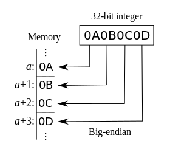
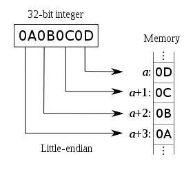

# String 类型

> 本篇是之前 JavaScript 学习总结的内容，代码示例基于 JavaScript 语言

学习字符串这节内容，需要理解以下几点内容：

1. 字符串是如何转为二进制数字在计算机显示的
2. 字符、字形、编码、解码
3. Unicode / ASCII / UTF8 是什么关系
4. 在 HTTP 请求`Content-Type：application/json;charset=utf-8`, 在 script 标签中设置`<script charset="utf-8" scr=""></script>`, HTML 中`<meta charset='utf-8'>`的意义
5. 字符转义格式：在 XML/HTML 中：`&#8733;` `&#x221d;`，在 JS 中使用`\u`：`\u221d`
6. 在 Javascript 中，用如何处理字符串在内存中的存储的

上面开篇我们就说过了，在计算机内存中储存和操作的数据都是二进制数据，并且需要根据上下文的情况判断当前二进制数据是文本还是数值或其它什么东西。上面在数值中我们讲了数值是使用 64 位双精度浮点数的方式在内存中存取的。这一节我们理解字符是如何转为二进制存储的。

## 概念：字符、字形、编码、解码

先说明几个概念：

你真的知道什么是字符嘛？

实际上我们在视图看到的，准确来说并不叫字符，而叫字形，即字符的图形化表示。

- 字符：是一个有名称的符号，也可以说字符是数字实体，即可以用数值编码表示的一个符号。
- 字符集：是一组字符的集合，也可以称字符表，其中每个字符都被指定了一个独有的整数，称为**码点**或称为**码位**。
- 字形：是字符的可视化图形。

对于程序员来说操作的是字符，而对于普通人看到的是字形。

比如 Unicode 编码规范表示百分号字符，它的名称是 PERCENT SIGN，用 Unicode 约定的十六进制数字来表示它对应的码点是：U+0025，而我们实际看到的`%`是百分号的字形。

但不一定每个字符都有对应的字形表示，比如有些字符是存在的，有数字实体的，但没有字形，所以在视图中是不显示的。如空格字符 SPACE(U+0020)、删除字符 DELETE(U+007F)、换行符 NewLine(U+000A)等。

> 这里遵循 Unicode 的约定，将字符以名称或十六进制数字表示，数字表示时带有前缀 U+。在 XML/HTML 或 JS 也有另一种约定的表示规范，比如删除字符 DELETE(`U+007F`)在 HTML 中表示`&#x007F;`，JS 中表示`\u007F`，都是指同一个字符实体。具体在后面转义字符会讲。

一个字形也可能由多个字符组合而成，比如梵文、音乐符号、emoij 表情等，同一个字形也可能代表不同的字符，比如`∑`可以用于表示希腊大写字母 SIGMA，也可表示求和字符（SUMMATION SIGN），所以不要把字符和字形混淆。

- 编码：将数字、字符、图片等等这些高级信息转为以二进制位表示的过程称为编码；
- 解码：将二进制位数据还原为高级信息的过程称为解码。

要进行编码和解码，就像数据加密和解密一样，必然需要遵循同一种协议作为规范，在数值编码和解码中浮点数就是其中一种规范，而在字符编码和解码也存在许多规范，这些规范你可以理解为就是字符与二进制数之间的建立的一个映射表。

## ASCII 编码

因为计算机最初是在美国普世的，他们的语言体系就 26 个英文字母，所以如果要罗列所有字符，基本也就是 26 个英文字母，再加上一些普遍使用的标点和特殊符号等，把这些字符收集起来，就是字符集。然后对照着这个字符集约定每个字符用什么数字表示，这个字符集跟数字的映射表就是美国最早确定的 ASCII 字符集，它约定了 128 个字符，按最大数 128 需要 7 位二进制数 1111111 表示，又因为计算机的基本操作单位是字节（Byte）, 即 8 位二进制，所以在 ASCII 字符编码中最高位为 0。即从 00000000 - 01111111 来表示 1-127 个字符，这就是 ASCII 编码。

可以看到 ASCII 即是一个字符集也是一个字符编码方案。也就是说 ASCII 即约定了所表示的字符，也直接确定了字符到计算机存储的二进制编码，所以也叫 ASCII 编码。

```
 --------            -------------
 | 字符 | --ASCII--> | 内存二进制 |
 --------            -------------
```

## 非 ASCII 编码

英语体系用 128 个字符编码就够了，但随着计算机在世界的普及，在其它语言体系中 128 个字符肯定是不够的。所以此后一段时间各个国家都根据本国的语言体系产生了很多其它的编码方案：

比如，在法语中，字母上方有注音符号，它就无法用 ASCII 码表示。于是，一些欧洲国家就决定，利用字节中闲置的最高位编入新的符号。比如，法语中的 é 的编码为 130（二进制 10000010）。这样一来，这些欧洲国家使用的编码体系，可以表示最多 256 个符号。

在亚洲国家的文字中，使用的符号就更多了，比如中国简体中文常见的编码方式是 GB2312，使用两个字节表示一个汉字，即一个汉字占用 16 个二进制位，并且约定两个字节的最高位都是 1，以区别与 ASCII 编码方案的最高位为 0，这样可以区别中文与西文（剩下的 14 个二进制位足够表示汉字字符）。

但是，这里又出现了新的问题。不同的国家有不同的字母，因此，哪怕它们都使用 256 个符号的编码方式，代表的字母却不一样。比如，130 在法语编码中代表了 é，在希伯来语编码中却代表了字母 Gimel (ג)，在俄语编码中又会代表另一个符号。所以互联网要在世界范围内共享信息，就需要一种通用的编码方案。这就是 Unicode 编码产生的背景。

## Unicode

在 1987 年，由于那时存在着众多互不兼容的编码方案，如 8 位的 ASCII 码、GB3212（简体中文）、Big5 码（繁体中文）等，Joe Becker(Xerox 公司员工)、Lee Collins(Apple 员工)和 Mark Davis(Apple 员工)共同发起了 Unicode 规范（Universal Character Set，也简称 UCS，通用字符集），旨在创建一个国际化的字符集。

- 1988 年发布第一版 Unicode 草案
- 1991 年 1 月 31 日，Unicode 联盟成立。致力于开发、维护、促进软件国际化标准和数据（尤其是 Unicode 标准）发展的非营利组织。
- 1991 年 10 月，Unicode 1.0 版发布
- 1992 年 6 月，Unicode 2.0 版发布
  ......
- 2018 年 6 月 5 日，Unicode 11.0

Unicode 最初只用两个字节即 16 位（0x0000 - 0xFFFF 范围）来定义所有字符，由于在每个版本中都会增加新的字符，所以在 1996 年 7 月中扩展到三个字节，但设计只使用 0x000000 - 0x10FFFF 区间的范围。这意味着共有 1114112 个字符空间，但这也足够使用，截止 Unicode 5.2 版本中，只分配了大约 100000 个字，还余下很多范围空间。

下面了解下 Unicode 标准中的几个概念：

### 分层

在 0-0x10FFFF 整个范围内进行了层次划分，分为 17 层，每层称为一个平面（Plane），每层可用 16 位，65536 个字符。

- 0x000000 - 0x00FFFF: 平面 0，即 BMP 平面，表示多种语言的基本常用字符，日常使用编码字符都位于这个平面
- 0x010000 - 0x01FFFF: 平面 1，即 SMP 平面，表示多种语言的辅助字符
- 0x020000 - 0x02FFFF: 平面 2，即 SIP 平面，表示多种语言的辅助表意字符
- 平面 3-13，暂未使用
- 0x0E0000 - 0x0EFFFF: 平面 14，即 SSP 平面，表示特殊目的的字符
- 0x0F0000 - 0X0FFFFF: 平面 15
- 0x100000 - 0x10FFFF: 平面 16，同平面 15 一起作为私人使用区段的辅助区间。

以上除平面 0 外，平面 1-16 统称为辅助平面或星际平面。

因为最常用的字符都位于平面 0，即基本平面。所以就以基本平面范围讲解 Unicode 中其它通用概念：

### 区块 Block

在平面 0 中，聚集了世界上绝大多数语言常用字符，所以 Unicode 设计者将同类语言相似的字符聚在一起，以此将平面划分为多个区块。在平面 0 中大约有 200 个区块。

- 0x000000 - 0x00001F: 控制字符
- 0x000020 - 0x00007F: 基本拉丁字母，兼容 ASCII 的编码
- .......省略
- 0x003400 - 0x004DBF: 中日韩统一表意文字扩展 A
- 0x004DC0 - 0x004DFF: 易经六十四卦符号
- 0x004E00 - 0x009FFF: 中日韩统一表意文字
- 0x00A000 - 0x00A48F: 彝文音节
- 0x00A490 - 0x00A4CF: 彝文字根
- .......省略

> 具体可以查的[Unicode® 字符百科](https://unicode-table.com/cn/)

### 码位（码点）

即区块中每个字符位置所在的数值，比如 0x005144，可以直接写成 0x5144（高位补 0），即 U+5144，表示汉字“兄”，处于基本平面中的中日韩统一表意文字区块。

这个 0x5144 就叫做字符“兄”的 Unicode 码位，或者说代码点。

现在是将字符“兄”映射到了数字编码 0x5144，这个二进制数有两个字节 16 位，按 ASCII 编码的逻辑，我们理论上是可以直接向系统申请两个字节内存空间存储它的。但实际上，计算机如何知道连续的两个字节是代表一个字符的编码呢？如果是用到辅助平面的编码字符，我们需要三个字节的内存区间，计算又如何知道这三个字节要连起来代表一个字符编码呢？

这就是 Unicode 编码系统与 ASCII 编码的不同，上面我们画了图，ASCII 编码因为字符数量少，只占用一个字节空间，所以可以直接将 ASCII 码编码进内存中。但 Unicode 规范虽然实现了所有字符的数字映射，但因为超出了一个字节编码，所以不能直接将编码写入内存，在将 Unicode 码位写入计算机内存的二进制机器码还需要进行**再编码**。自然再编码过程又需要一套通用协议，这就是 UTF32 / UTF16 / UTF8 这些编码规范起作用的地方，通常也称 UTF32/16/8 这种编码方案是 Unicode 字符集的实现。

> Unicode 编码系统，可分为编码方式和实现方式两个层次。

> 但也有另外一种理解：<br>字符集和字符编码不是一个概念，字符集定义了文字和二进制的对应关系，为字符分配了唯一的编号，而字符编码规定了如何将文字的编号存储到内存中。<br>所以按这个逻辑，Unicode 只是作为一个字符集的概念，所以也称 Unicode 字符集。而 UTF8 之类才是字符编码。<br>有的字符集在制定时就考虑到了编码的问题，是和编码结合在一起的，像 ASCII，即叫 ASCII 字符集也叫 ASCII 编码；有的字符集只管制定字符的编号，至于怎么编码，是其他人的事情，如 Unicode 系统。

```
 --------               -------                 --------------------
 | 字符 | --Unicode --> | 码位 | --UTF32/16/8-- | 内存二进制（码元） |
 --------               -------                 --------------------
```

> 码元：即一个字符实际在内存中存储的二进制数。在 ASCII 编码中，码位等于码元，但在 Unicode 系统中视不同的编码规则不同

## UTF-32

从上面码位内容可知，Unicode 码位到内存机器码的主要问题是：**如何让计算机识别连续的字节是表示一个字符编码？**。解决这个问题的方案之一就是 UTF32 编码。

UTF32 编码简单粗暴，直接将每个字符分配固定长度的内存。因为 Unicode 目前设计最大的码位是 0x10FFFF，即 32 位 3 个字节，那就直接固定死所有字符在内存中的存储长度为三个字节 32 位，不足的高位补 0。

如果是字符串，就是一串连续的字符序列，它们在内存中就按次序挨着存放，

这种方案最简单，直接将字符编号放入内存中即可，不需要任何转换，并且以后在字符串中定位字符、修改字符都非常容易。但缺点也很显示，就是占用内存空间大。

在互联网世界中，英文体系的字符仍占绝大多数，所以英文字母和阿拉伯数字在 Unicode 中的编号都非常小，用一个字节足以容纳（这是在 Unicode 设计之初，为了兼容 ASCII，在设计时刻意保留了原来 ASCII 中字符的编码），即使象形文字体系的亚洲国家，如汉字，也只需要两个字节，所以像 UTF32 编码方案会造成很多内存浪费。自然也就会催生更优的方案。

## UTF-16

UFT-16，是一种比较折中的编码方案，它使用 2 个或者 4 个字节来存储。

- 对于 Unicode 字符码位范围在 0 ~ FFFF 之间基础平面的字符，UTF-16 使用两个字节存储，并且直接存储 Unicode 编号，不用进行编码转换，这跟 UTF-32 非常类似。
- 对于 Unicode 字符码位范围在 10000~10FFFF 之间辅助平面的字符，UTF-16 使用四个字节存储。
  - 需要先将码位减去 0x10000（基本平面和辅助平面的分界值）等到差值
  - 然后的具体的（从前往后）第 1 个字节高位固定 110110，，第 3 个字节高位固定为 110111，剩余位按顺序填充差值。

> 因为减去了 0x10000，所以第 1 字节高位的值基本就是固定的 0xD8，称为前导代理。第 3 个字节基本固定为 0xDC，称为后尾代理。

| Unicode 范围<br>十六进制 | 具体的 Unicode 字符<br>二进制（码位） | UTF-16 编码（码元）                 | 编码后的字节数 |
| ------------------------ | ------------------------------------- | ----------------------------------- | -------------- |
| 0000 0000 ~ 0000 FFFF    | xxxxxxxx xxxxxxxx                     | xxxxxxxx xxxxxxxx                   | 2              |
| 0001 0000---0010 FFFF    | yyyy yyyy yyxx xxxx xxxx              | 110110yy yyyyyyyy 110111xx xxxxxxxx | 4              |

示例：
字符 | Unicode 码位<br>十六进制 | Unicode 字符<br>二进制（码位） | 减去分界值后差值<br>二进制 | UTF-16 编码（码元） | 码元十六进制 |编码后的字节数
--|--|--|--|--|--|--
国 | 56FD | 0101 0110 1111 1101 | | 0101 0110 1111 1101 | 56FD | 2
🐄 | 1F404 | 0001 1111 0100 0000 0100 | 0000 1111 0100 0000 0100 | 11011000 00111101 11011100 00000100 | D8 3D DC 04 | 4

所以对 ASCII 编码范围内的拉丁字符，UTF16 编码也会产生内存浪费，因为正常一个字节就可以存储却用了两个字节的内存空间。所以 UTF-16 编码方案对根本问题解决并不彻底。所以出现 UTF8 编码方案。

## UTF-8

UTF-8 的编码的设计逻辑很简单：如果字符用一个字节存储就可以那就申请一个字节内存空间，如果需要两个字节，那就申请两个字节空间，依次类推。所以 UTF-8 是一种变长的编码方案。

但它需要解决一个问题：不像 UTF32 是固定长度存储，取一个字符知道是三个字节，UTF16 也有规则判断取一个字符是读取两个字节还是四个字节。但 UTF-8 采用可变长度编码，计算机如何知道一个字符该读取一个字节还是两个字节或是更多字节呢，比如汉字字符“兄” `U+5144`，怎么知道是 51 表示一个字符，还是 5144 表示一个字符呢？

所以 UTF-8 编码约定如下规则：

- 对于编号较小的、用一个字节足以容纳的字符，我们就可以规定这个字符编号的最高位（Bit）必须是 0，（同 ASCII 编码一样）；
- 对于编号较大的、要用两个字节存储的字符，我们就可以规定这个字符编号的高字节的高位必须是 110，低字节的最高位必须是 10；
- 对于编号更大的、需要三个字节存储的字符，我们就可以规定这个字符编号的高字节的高位都必须是 1110，其后每个字节高位是 10。

> 即左边第一个高字节有几个 1，就可解读为需要几个字节。其它字节高位固定以 10 开头

具体的表现形式为：

- 0xxxxxxx：单字节编码形式，这和 ASCII 编码完全一样，因此 UTF-8 是兼容 ASCII 的；
- 110xxxxx 10xxxxxx：双字节编码形式；
- 1110xxxx 10xxxxxx 10xxxxxx：三字节编码形式；
- 11110xxx 10xxxxxx 10xxxxxx 10xxxxxx：四字节编码形式。

| 字符 | 具体的 Unicode 字符（码位）<br>二进制 / 十六进制 | UTF-8 编码（码元）         | 编码后的字节数 |
| ---- | ------------------------------------------------ | -------------------------- | -------------- |
| N    | 01001110 / 4E                                    | 01001110                   | 1              |
| æ    | 11100110 / E6                                    | 11000011 10100110          | 2              |
| ⻬   | 00101110 11101100 / 2E EC                        | 11100010 10111011 10101100 | 3              |

程序在定位字符时，从前往后依次扫描，如果发现当前字节的最高位是 0，那么就把这一个字节作为一个字符编号。如果发现当前字节的最高位是 1，那么就继续往后扫描，如果后续字节的最高位不在是 10，则停止，把之前字节合并为一个字符编码；

对于常用的字符, Unicode 码位范围是 0 ~ FFFF，用 1~3 个字节足以存储，只有及其罕见，或者只有少数地区使用的字符才需要 4~6 个字节存储。所以 UTF-8 是目前最普遍的编码方案。但也不是最优编码方案，具体要看设计者依怀表权衡采用合适编码方案。

比如有些汉字字符，如上面的“齐”字，Unicode 码位是两个字节，使用 UTF-8 编码，因为标识位在存在，实际在内存中存储的码元就需要三个字节。但如果使用 UTF-16 编码，实际存储仍然是两个字节空间。

## 宽字符和窄字符

有的编码方式采用 1~n 个字节存储，是变长的，例如 UTF-8、GB2312、GBK 等；如果一个字符使用了这种编码方式，我们就将它称为多字节字符，或者称为窄字符。

有的编码方式是固定长度的，不管字符编号大小，始终采用 n 个字节存储，例如 UTF-32、UTF-16 等；如果一个字符使用了这种编码方式，我们就将它称为宽字符。

所以 Unicode 字符集可以使用窄字符的方式存储，也可以使用宽字符的方式存储。ASCII 只有一个字节，无所谓窄字符和宽字符。

## 位顺序标识（BOM）

对于定长编码方式，比如 UTF32 / UTF16，还细分出两种码元具体存储的不同方式，即大尾序（big-endian）和小尾序（little-endian）储存形式。

举例说：UTF16 编码基本平面的字符使用两个字节，在内存存储中，到底是高位字节+低位字节，还是低位字节+高位字节的呢？

- 大尾序方式：高位字节+低位字节，（也称大端序）（默认方式）
- 小尾序方式：低位字节+高位字节，（也称小端序）




示例：

```
依上面字符“齐”，unicode码位：U+2EEC
如果使用UTF-16BE大端序方式存储，码元表示为：2EEC （00101110 11101100）
如果使用UTF-16LE小端序方式存储，码元表示为：EC2E （11101100 00101110）
```

在以 UTF-16 编码的文件的编码开头，都会放置一个 U+FEFF 字符作为位顺序标识符（Byte Order Mark BOM):其中 UTF-16LE 以 FFFE 代表，UTF-16BE 以 FEFF 代表，以显示这个文字档案是以 UTF-16 编码时以何种存储方式写入。

> U+FEFF 字符在 UNICODE 中代表的意义是 ZERO WIDTH NO-BREAK SPACE，顾名思义，它是个没有宽度也没有断字的空白。刚好可以用来作为标识。

但现在使用 BOM 来标识存储顺序很少用，因为现在广泛采用的都是 UTF-8 编码，它是变长编码方案，不需要 BOM。对于定长的编码方案都有各自指明的 UTF-16BE / UTF-16LE / UTF-32BE / UTF-32LE。所以 BOM 头也用不到。

## UCS-2 编码

上面介绍了 Unicode 的几种编码方案，那在 JavaScript 中具体使用哪种编码方案对字符在内存中进行编码呢？答案是上述方案都没有采用。

**JS 对字符采用 UCS-2 编码**

这个情况是有历史原因的。

互联网还没出现的年代，曾经有两个团队，不约而同想搞统一字符集。一个是 1988 年成立的 Unicode 团队，另一个是 1989 年成立的 UCS 团队（Universal Character Set，也简称 UCS，通用字符集）。等到他们发现了对方的存在，很快就达成一致：世界上不需要两套统一字符集。

1991 年，两个团队决定合并字符集。也就是说，从今以后只发布一套字符集，就是 Unicode，并且修订此前发布的字符集，UCS 的码点将与 Unicode 完全一致。也是这一年合并成立了 Unicode 联盟。

因为 UCS 的开发进度快于 Unicode，1990 年就公布了第一套编码方法 UCS-2，固定使用 2 个字节表示已经有码点的字符。（那个时候只有一个平面，就是基本平面，所以 2 个字节就够用了。）UTF-16 编码迟至 1996 年 7 月才公布，明确宣布是 UCS-2 的超集，即基本平面字符沿用 UCS-2 编码，辅助平面字符定义了 4 个字节的表示方法。

两者的关系简单说，就是 UTF-16 取代了 UCS-2，或者说 UCS-2 整合进了 UTF-16。所以，现在只有 UTF-16，没有 UCS-2。

### 为什么 JavaScript 不选择更高级的 UTF-16，而用了已经被淘汰的 UCS-2 呢？

因为在 JavaScript 语言出现的时候，还没有 UTF-16 编码。1995 年 5 月，Brendan Eich 用了 10 天设计了 JavaScript 语言；10 月，第一个解释引擎问世；次年 11 月，Netscape 正式向 ECMA 提交语言标准。对比 UTF-16 的发布时间（1996 年 7 月），就会明白 Netscape 公司那时没有其他选择，只有 UCS-2 一种编码方法可用！

- 1990 年，UCS 编码发布，固定 2 个字节编码字符
- 1995.5，JavaScript 诞生
- 1995.10，Netscape 导航者浏览器中实现 JS 解释器
- 1996.7，UTF-16 发布，取代 UCS-2
- 1996.11，Netscape 向 ECMA 提 JavaScript 语言标准

由于 JavaScript 采用 UCS-2 编码，也就支持 UTF-16 中基本平面字符的编码，并且 UCS-2 标准对所有字符都是 2 个字节。如果是辅助平面内 3 个字节的字符，会当作两个双字节的字符处理。

因此 JavaScript 的部分字符函数都受到这一点的影响，无法返回正确结果。

### String.length 字符串长度计算问题

`string.length` 对于基础平面区的字符，码位最大是 16 位，JS 中使用 UCS-2 编码方案存储字符，在基本平面同 UTF-16 编码完全一样。在内存空间中存储的码元表示时也是两个字节 16 位。所以字符长度计算跟字符的码位个数、码元个数都是一致的。即一个字符长度等于两个字节。

比如:

```js
let str = "AB"
console.log(str === "\u0041\u0042") // 即 str = 'AB'
console.log(str.length) // 2
```

但如果某个字符的码位是超出基础平面区，在辅助平面内的，比如字形：&#128004;，它的码位是`U+1F404`，那根据 UTF-16 编码规范，辅助平面区的字符在内存存储时需要 4 个字节空间。4 个字节的编码不属于 UCS-2，JavaScript 不认识，只会把它看作单独的两个字符。

比如，下面这个 emoij 字符：

```js
let str = "🐄"
console.log(str.length) // 2
console.log(str === "\ud83d\udc04") // true
```

| 字符 | 码位      | 码位二进制               | 减去 BMP 平面临界值<br>0x10000 | UTF-16 编码存储的码元<br>二进制     | UTF-16 编码存储的码元<br>十六进制 | 转义字符表示      |
| ---- | --------- | ------------------------ | ------------------------------ | ----------------------------------- | --------------------------------- | ----------------- |
| 🐄   | `U+1F404` | 0001 1111 0100 0000 0100 | 0000 1111 0100 0000 0100       | 11011000 00111101 11011100 00000100 | d8 3d dc 04                       | `\ud83d` `\udc04` |

这就造成了在 HTML 中直接写转义字符`&#128004;`解码显示没有问题，但如果在 JS 中用转义字符直接表示`\u1F404`，在解码显示会转为两个字符，所以此时如果获取这个字符的长度就会为 2 而不是视图上看到的 1。

### ES6 作出的改善

当然作为 JS 语言的规范 ECMAScript 也在不断弥补这个问题，大幅增强了 Unicode 支持。

1. ES6 可以自动识别 4 字节的码点。因此，最新遍历 API 遍历字符串不会出错。

```js
let str = "🐄"
console.log(str.length) // 2
console.log(str === "\ud83d\udc04") // true

let num = 0
for (let s of str) {
  num++
  console.log(s) // 🐄
}
console.log(num) // 1
```

2. 转义字符改善

```js
"🐄" === "\u1F404" // false
"🐄" === "\u{1F404}" // true
```

3. 正则表达式添加 u 修饰符

```js
/^.$/.test('🐄') // false
/^.$/u.test('🐄') // true
```

4. 字符串 ES6 处理函数

ES6 新增了几个专门处理 4 字节码点的函数。

```js
// String.fromCodePoint()：从Unicode码点返回对应字符
// String.prototype.codePointAt()：从字符返回对应的码点
String.fromCodePoint(0x1f404) // 🐄
"🐄".codePointAt().toString(16) // 1F404
```

5. normalize 方法

允许"Unicode 正规化"，即将两种方法转为同样的序列。[MDN normalize](https://developer.mozilla.org/zh-CN/docs/Web/JavaScript/Reference/Global_Objects/String/normalize)

6. 第三方库解决

这个问题可以通过第三库解决，例如 Punycode.js。

```js
var puny = require("puycode")
puny.ucs2.decode(str).length // 1
```

## Unicode 的解码

上面讲了字体到内存空间的编码，那在前端开发中，更多的是接收数据在 web 端或其它视图层，将编码的字符进行解码显示，所以需要指示解码采用哪种规范。

- 如果文件是通过 HTTP(S)获取的，那么其编码由`Content-Type`响应头字段指定。如`Content-Type: text/html;charset='utf-8'`
- 对 JS 脚本文件，也可以在`<script>`标签指定，设置`<script charset="utf-8" scr=""></script>`
- 如果都没有保证解码规范，那最终会获取 HTML 中`<meta charset='utf-8'>`

所以一般建议在 HTTP 请求响应中设置解码规范，以及在 HTML 文件元信息标签中设置，而且`<meta charset='utf-8'>`标签应该位于 head 标签第一个元素。

## 转义字符表示

为了避免解码时解码规则不匹配，比如某个字形用 UTF8 或 UTF16 可能是两个不同的字符，但如果直接在 HTML 或 JS 中使用 Unicode 的码位表示字符，则不管解码规则如何都是正确的字形，这称为转义字符。

在 XML/HTML 中，直接将所需字符的码位放在`&#`和`;`中间即可使用码位转义一个字符。码位可以直接用十六进制表示也可以再转成十进制表示。如果是十六进制表示，前面需要加`x`

```
数学运算符 `∝` 的码位是 221d（十六进制）,转成十进制是8733，
所以在HTML中转义字符可以表示为：`&#x221d;` 或 `&#8733;`
```

在 JS 中，转义字符我们使用`\u`开头，后面接四位十六进制，所以同样的运算符在 JS 可以表示为：`\u221d`，如果是辅助平面内的字符`U+1F404`，因为上述 JS 采用 UCS-2 编码的问题会解码成两个字符，所以要用 ES6 最新的写法：`\u{1F404}`。

```js
"🐄" === "\u1F404" // false
"🐄" === "\u{1F404}" // true
```

另外在 Unicode 的语义中表示某个字符可以用数字实体表示，即使用`U+`开头，`U+221d`

## 参考资料

[阮一峰 字符编码笔记：ASCII，Unicode 和 UTF-8](http://www.ruanyifeng.com/blog/2007/10/ascii_unicode_and_utf-8.html)<br>
[阮一峰 Unicode 与 JavaScript 详解](http://www.ruanyifeng.com/blog/2014/12/unicode.html)<br>
[字符编码的概念（UTF-8、UTF-16、UTF-32 都是什么鬼）](https://blog.csdn.net/guxiaonuan/article/details/78678043)<br>
[大端序和小端序](https://www.cnblogs.com/flysnail/archive/2011/10/25/2223721.html)<br>
《深入理解 JavaScript》P354<br>
《JavaScript 程序设计》P355
